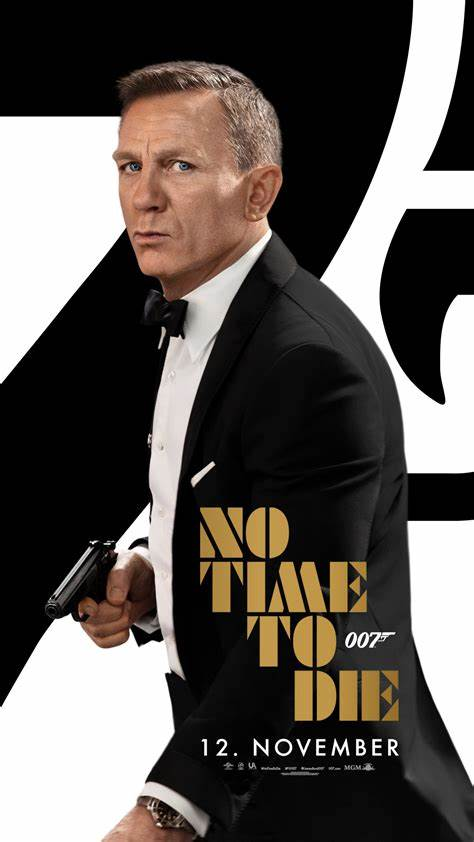

# cinemoon
Willkommen bei cinemoon.

In unserem Github finden Sie unseren umfangreichen Code!

Bereit für Abgabe:
- Homepage
- Datenschutz
- Event
- Impressum
- Gastro

Probleme:
- Banner Hintergrundbild hat schlechte Resolution
- Navigationsbar bleibt nicht im Banner wenn man weit raus zoomt
- Programmseite muss noch richtig gemacht werden
- Supportseite ist noch nicht fertig
- Gastroseite hat einen Bug

Zwischenspeicher:
                

                    <h2> 25 Jahre 007 </h2>
                    

                        
                    
  
                    

                        25 jahre ist es her seitdem die berühmte 007, auch bekannt als james Bond, zum ersten mal die Leinwand bestrahlte.
                          Das muss natürlich gefeiert werden! Und aus diesem Grund <strong>schenken wir jedem Kinobesucher 25% auf alles!</strong> 
                        Die einzige Bedingung: <strong>Kleidet euch wie ein eleganter Superagent.</strong>
                         Wir freuen uns euch im Kino zu treffen!
                    
  
                

.highlight {
display:inline-block;
margin-bottom: 30px; 
}

div#JamesBond {
    float:left;
    width: 45%;
    height: 45%;
    margin-bottom: 20px;
}

div.highlight p#beschreibung {
    padding-top: 5%;
    padding-left: 10%;
    border-left: 2px;
    border-color: white; 
}

strong {
    color: rgb(66, 119, 211);
}

h1 {
    color:white;
    margin-bottom: 20px;
}

h2 {
    color:rgb(255, 252, 221);
    padding-left: 20px;
    padding-top:10px;
    padding-bottom:5px;
}

a img {
    height: 400px;
}